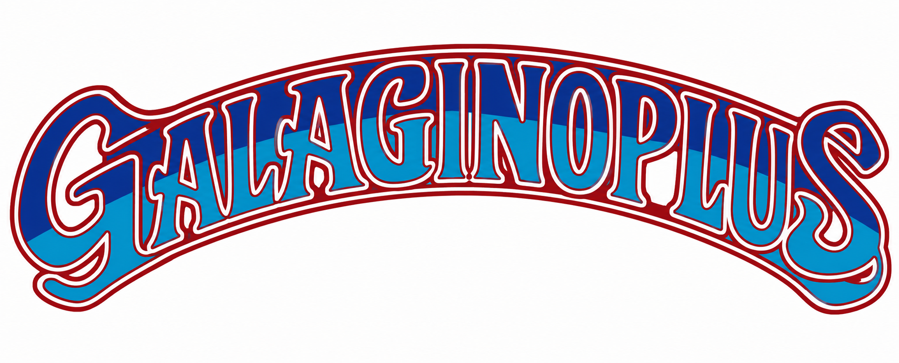

# A new Galagino with 50 games, the ability to save the highest scores of each game and the original marquee in full color !

The main new feature of this version, besides the new games added, is the permanent saving of high scores and player names. You can also configure auto-fire and audio mute in attract mode in config.h.

This version uses an ESP32-S3 N16R8 board to take advantage of the increased memory required to display all the games and marquees simultaneously.

This repo is a port of Speckhoiler version of [Galagino](https://github.com/speckhoiler/galagino) which in turn is a port of Till Harbaum's [Galagino](https://github.com/harbaum/galagino) ported to platformio.

This port is NOT by the original authors, so please do not bother them with issues.

I used and modified the games 1942, Dig dug, Donkey Kong, Frogger, Galaga and Pac Man from [Till Harbaum's Galagino](https://github.com/harbaum/galagino).

I used and modified the games Anteater, Bagman, Crush roller, Eyes, Lizard Wizard, Mr. TNT and The Glob from [Speckhoiler's Galagino](https://github.com/speckhoiler/galagino).

I used and modified the games Bombjack, Mr. Do!, Donkey Kong Jr., Donkey Kong 3 and Starforce from [Alby1970](https://github.com/Alby1970).

I used and modified the games Gyruss, Lady Bug, Ms. Pacman, Time Pilot, Tutankham, Space Invaders and Galaxian from [Galagino 3](https://github.com/SurvivalHacking/galagino3).

I used and modified the game Phoenix from [Spinnerino](https://github.com/SurvivalHacking/spinnerino).

I used and modified the games Moon Cresta, Scramble and Super Cobra from [Galagino](https://github.com/galagino/galagino)

I used and modified the game Pinball Action from [BaasPierre](https://github.com/BaasPierre)

Donkey Kong 3 sound cpus have been added by me.

Graphical bugs have been fixed in Mr. Do!

Pengo is not the Alby1970 conversion, but a conversion of mine (also change the file containing the roms), with the original "PopCorn" music and the creation of the labyrinth at the beginning of each level.

The new games added by me in this port are: Ali Baba and 40 Thieves, Amidar, Bump 'n' jump, Burger time, Circus Charlie, Fantasy, Gaplus, Kangaroo, Mappy, Nibbler, Pooyan, Qix, Roc'n rope, Scrambled egg, Tower of Druaga, 
Turtles, Van Van Car, Vanguard and Xevious.

All games can be active at the same time if you use a ESP32-S3 N16R8 board. 

You can also use an ESP32-S3 board without additional memory; in that case, to compile correctly, you will need to disable some games due to the lack of memory.

You can select the games in the machines.h file.

//#define ENABLE_1942 <-- Disabled

#define ENABLE_ALIBABA <-- Enabled

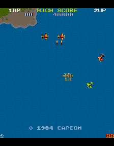
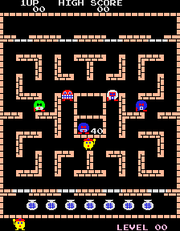
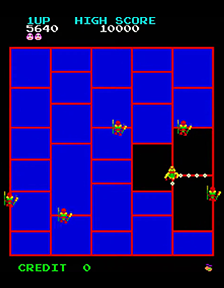
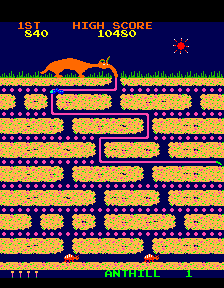
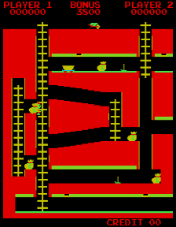
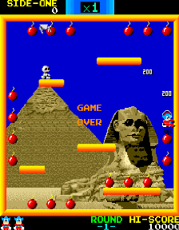
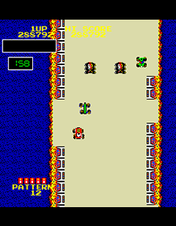
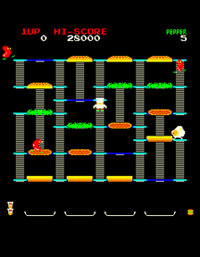
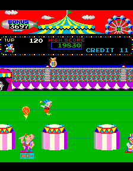
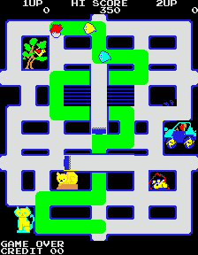
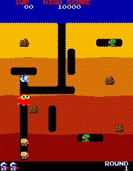
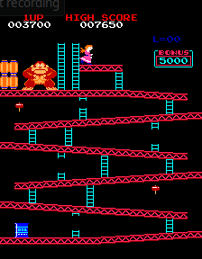
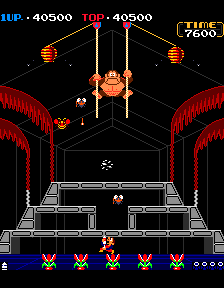
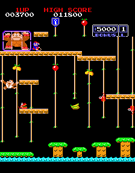
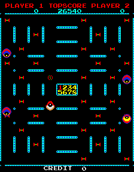
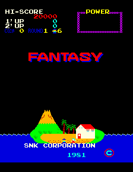
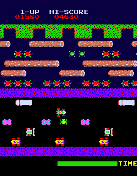
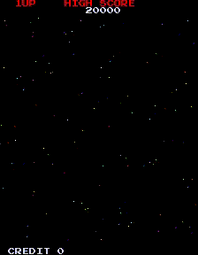
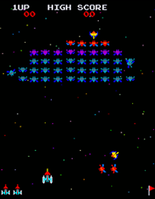
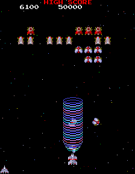
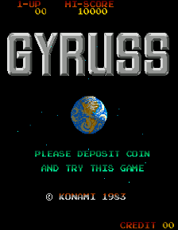
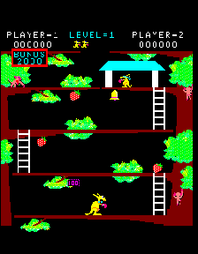
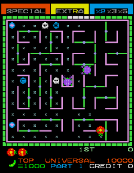
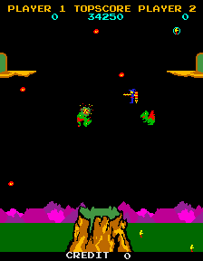
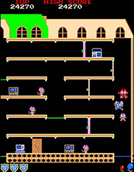
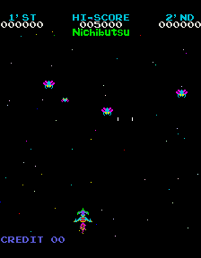
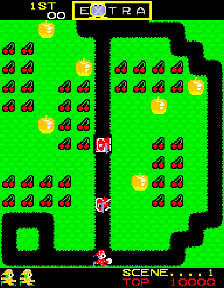
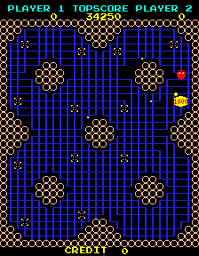
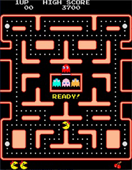
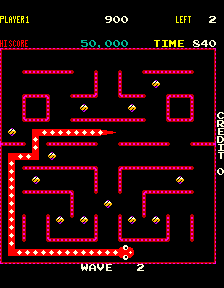
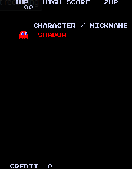
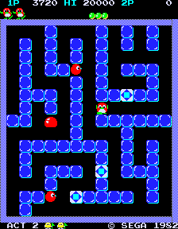
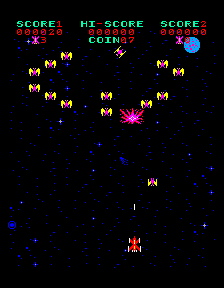
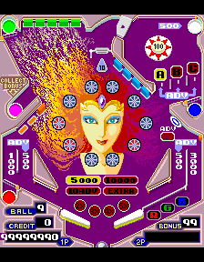
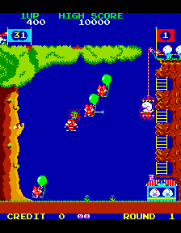
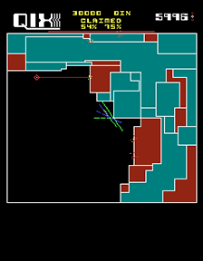
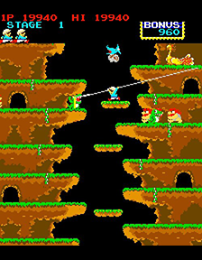
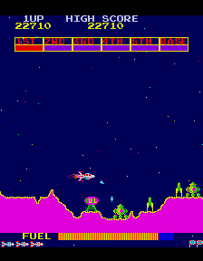
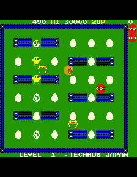
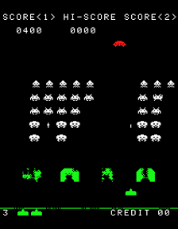
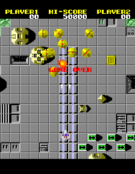
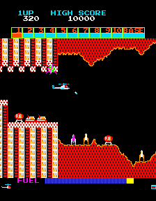
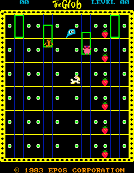
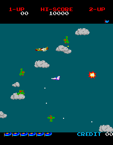
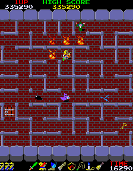
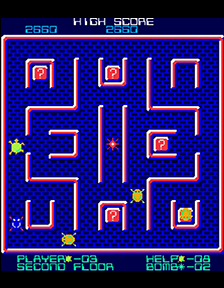
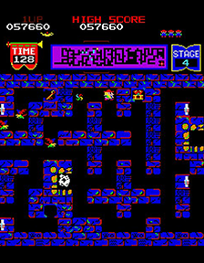
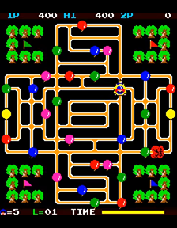
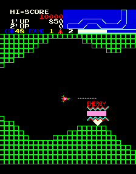

## Hardware

## Software

Like in the original from Till Harbaum's Galaga emulator, download these files:

* The [Galagino Plus specific code](source/) contained in this repository
* A [Z80 software emulation](https://fms.komkon.org/EMUL8/Z80-081707.zip) by [Marat Fayzullin](https://fms.komkon.org/)
* The original ROM files. Please download the zip files with the exact names.
    * [1942](https://www.google.com/search?q=1942.zip+arcade+rom)
    * [Ali Baba and 40 Thieves](https://www.google.com/search?q=alibaba.zip+arcade+rom)
    * [Amidar](https://www.google.com/search?q=amidar.zip+arcade+rom)
    * [Anteater](https://www.google.com/search?q=anteater.zip+arcade+rom)
    * [Bagman](https://www.google.com/search?q="bagmanm2.zip"+download) (Important: filename with "m2")
    * [Bombjack](https://www.google.com/search?q=bombjack.zip+arcade+rom)
    * [Bump 'n' jump](https://www.google.com/search?q=bnj.zip+arcade+rom)
    * [Burger time](https://www.google.com/search?q=btime.zip+arcade+rom)
    * [Circus Charlie](https://www.google.com/search?q=circusc.zip+arcade+rom)
    * [Crush Roller](https://www.google.com/search?q=crush.zip+arcade+rom)
    * [Digdug](https://www.google.com/search?q=digdug.zip+arcade+rom)
    * [Donkey Kong (US set 1)](https://www.google.com/search?q=dkong.zip+arcade+rom)
    * [Donkey Kong 3](https://www.google.com/search?q=dkong3.zip+arcade+rom)
    * [Donkey Kong Jr. (Japan)](https://www.google.com/search?q=dkongjrj.zip+arcade+rom) (Important: filename with "jrj")
    * [Eyes](https://www.google.com/search?q=eyes.zip+arcade+rom)
    * [Fantasy](https://www.google.com/search?q=fantasy.zip+arcade+rom)
    * [Frogger](https://www.google.com/search?q=frogger.zip+arcade+rom)
    * [Galaga (Namco Rev. B ROM)](https://www.google.com/search?q=galaga.zip+arcade+rom)
    * [Galaxian](https://www.google.com/search?q=galaxian.zip+arcade+rom)
    * [Gaplus](https://www.google.com/search?q=gaplus.zip+arcade+rom)
    * [Gyruss](https://www.google.com/search?q=gyruss.zip+arcade+rom)
    * [Kangaroo](https://www.google.com/search?q=kangaroo.zip+arcade+rom)
    * [Lady Bug](https://www.google.com/search?q=ladybug.zip+arcade+rom)
    * [Lizard Wizard](https://www.google.com/search?q=lizwiz.zip+arcade+rom)
    * [Mappy](https://www.google.com/search?q=mappy.zip+arcade+rom)
    * [Moon Cresta](https://www.google.com/search?q=mooncrst.zip+arcade+rom)
    * [Mr. Do!](https://www.google.com/search?q=mrdo.zip+arcade+rom)
    * [Mr. TNT](https://www.google.com/search?q=mrtnt.zip+arcade+rom)
    * [Ms. Pacman](https://www.google.com/search?q=mspacman.zip+arcade+rom)
    * [Nibbler](https://www.google.com/search?q=nibbler.zip+arcade+rom)
    * [Pac-Man (Midway)](https://www.google.com/search?q=pacman.zip+arcade+rom)
    * [Pengo](https://www.google.com/search?q=pengo.zip+arcade+rom) 
    * [Phoenix](https://www.google.com/search?q=phoenix.zip+arcade+rom)
    * [Pinball Action](https://www.google.com/search?q=pbaction.zip+arcade+rom)
    * [Pooyan](https://www.google.com/search?q=pooyan.zip+arcade+rom)
    * [Qix](https://www.google.com/search?q=qix.zip+arcade+rom)
    * [Roc'n Rope](https://www.google.com/search?q=rocnrope.zip+arcade+rom)
    * [Scramble](https://www.google.com/search?q=scramble.zip+arcade+rom)
    * [Scrambled egg](https://www.google.com/search?q=scregg.zip+arcade+rom)
    * [Space Invaders](https://www.google.com/search?q=invaders.zip+arcade+rom)
    * [Starforce](https://www.google.com/search?q=starforc.zip+arcade+rom)
    * [Super Cobra](https://www.google.com/search?q=scobra.zip+arcade+rom)
    * [The Glob](https://www.google.com/search?q=theglobp.zip+arcade+rom) (Important: filename with "p")
    * [Time Pilot](https://www.google.com/search?q=timeplt.zip+arcade+rom)
    * [Tower of Druaga](https://www.google.com/search?q=todruaga.zip+arcade+rom)
    * [Turtles](https://www.google.com/search?q=turtles.zip+arcade+rom)
    * [Tutankham](https://www.google.com/search?q=tutankhm.zip+arcade+rom)
    * [Van Van Car](https://www.google.com/search?q=vanvan.zip+arcade+rom)
    * [Vanguard](https://www.google.com/search?q=vanguard.zip+arcade+rom)
    * [Xevious](https://www.google.com/search?q=xevious.zip+arcade+rom)

Galagino Plus uses code that is not freely available and thus not included in this repository. Preparing the firmware thus consists of a few additional steps:

* If you do not have Python installed, download it from here. [Python 3.13.0](https://www.python.org/downloads/release/python-3130)
* Then install the Phyton Pillow Imaging Library. For that, run the command: pip install pillow
* Optional: If you want to run the logoconv.py to recreate the menu logos, you must install NumPy: pip install numpy
* The ROM ZIP files have to be placed in the [romszip directory](romszip/), together with the ZIP file containing the Z80 emulator.
* A set of [python scripts](romconv/) is then being used to convert and patch the ROM data and emulator code and to include the resulting code into the galagino machines directory. For all games, just use conv__all.bat.

The [ROM conversion](./romconv) create a whole bunch of additional files in the [source directory](./source). Please check the README in the [romconv](./romconv) directory for further instructions.
Please ensure that the stripts run without errors!

With all these files in place, the source folder can be loaded into visual studio code with the [PlatformIO](https://platformio.org/) plugin. The needed
platform packages and the arduino framework will be installed during compilation automatically.
For best performance, compile and upload the release version. **All games are running at nearly 100% speed**.

Like in the original:
If you want to use a LED stripe, you have to download FastLED library.
If you want to use a nunchuck, you need the NintendoExtensionCtrl library - emulation will be slower.
 

## Configuration

The Galagino Plus code can be configured through the [config.h](./source/src/config.h), [machines.h](./source/src/machines.h) and [platformio.ini](./source/platformio.ini) file. 

## Controls

With the current configuration, the buttons have the following additional functions:
* Volume up: Hold coin button and push the joystick up. Default setting is 3. 1 is the loudest.
* Volume down: Hold coin button and push the joystick down.
* Return back to menu: Hold the start button for more than 3 seconds. Attract mode is then active again.
* Demo sounds off: To disable the demo sounds of Galaga, Digdug, The Glob, Anteater, Bombjack and Pengo hold down the fire button while turning it on.
* The Glob game: Push coin button to call the elevator.
* Tutankham: Push coin button for the flash bomb.
* Roc'n Rope: Push coin button to throw the rope.
* Pinball Action: Push coin button for the left flipper, push the fire for right flipper, move down to start a ball, move up to tilt  

To disable auto fire, disable this line in config.h:

#define AUTOFIRE_ENABLED

Autofire work only in the following games: 1942, Eyes, Galaga, Galaxian, Gaplus, Gyruss, Moon Cresta, Phoenix, Scramble, Space invaders, Star Force, Super Cobra, Time Pilot, Tutankham, Vanguard and Xevious.

## Attract mode

In Attract mode, the machine cycles through all games if you do not touch the joystick. The games end after 5 minutes (you can change this value inside config.h).

#define MASTER_ATTRACT_MENU_TIMEOUT  1000 * 10  // start games while sitting idle in menu for 10 seconds, undefine to disable

#define MASTER_ATTRACT_GAME_TIMEOUT  60000 * 5  // restart after 5 minutes 

Enable this for mute audio in attract mode

#define MASTER_ATTRACT_MUTE_AUDIO

## Limitations

Known game issues:
* Gyruss: The sound cpu I8039 is missing - so there is no drum sound. Sometimes sprites appear that are no longer in use.
* Tutankham: Some sounds are not playable. 
* Super Cobra: The helicopter doesn't sound like a helicopter. It sounds very unpleasant — Volume was turned down.
